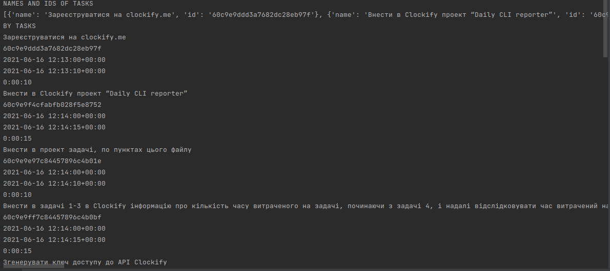
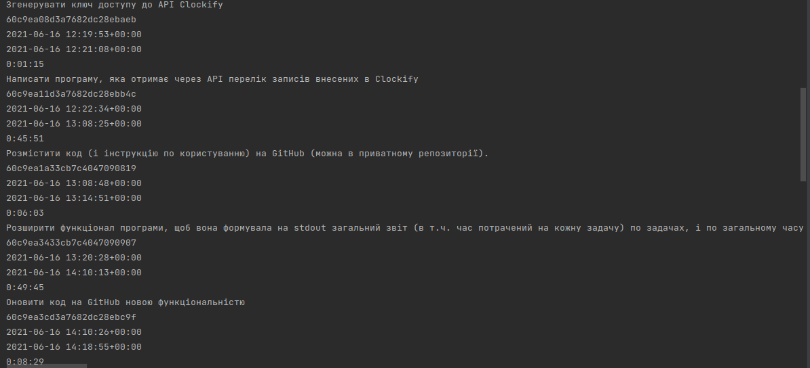
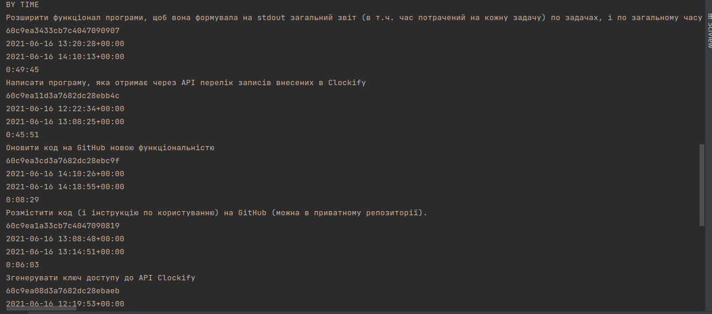
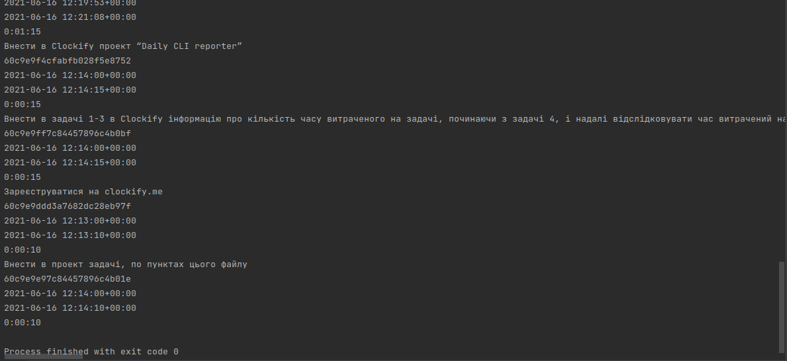

# test_task
Program to get names of all tasks from `https://clockify.me`

## Run Project
To run project you should start module main.py

## About
Code get all tasks from your account and make a report base on these data, sort them in to ways:
1) By task names(from firs created to last)
2) By time of duration

## Report example





## .env file
``.env`` has such structure:
```
export API_KEY = 'your-api-key'
export NAME = 'name-of-your-projecrt'
```
